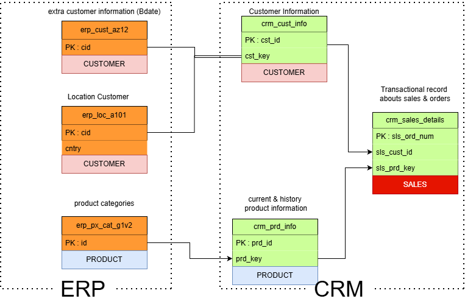

# 🛒 End-to-End SQL Data Warehouse: Sales Analytics

## 📌 Project Overview
This project demonstrates the development of a modern **Data Warehouse** (DWH) using **Microsoft SQL Server**. The goal is to integrate disparate sales data from two simulated sources—a **CRM system** and an **ERP system**—into a single source of truth for analytics.

The project follows the **Medallion Architecture** (Bronze, Silver, Gold layers) to ensure data quality, consistency, and optimized query performance for Business Intelligence (BI) reporting.

## 🏗️ Architecture & Workflow
The ETL (Extract, Transform, Load) pipeline is implemented via **T-SQL Stored Procedures**, structured into three logical layers:

### 1. 🥉 Bronze Layer (Raw Layer)
* **Purpose:** Ingest raw data directly from source files (CSV).
* **Process:** Data is stored in its original format (Full Load) with minimal changes.
* **Role:** Acts as a historical archive and landing zone.

### 2. 🥈 Silver Layer (Cleansed Layer)
* **Purpose:** Clean, standardize, and integrate data.
* **Process:**
    * Handling NULLs and duplicates.
    * Trimming whitespace and standardizing naming conventions.
    * Merging CRM and ERP data into unified tables.
* **Role:** Provides a clean, trusted dataset for transformation.

### 3. 🥇 Gold Layer (Curated Layer)
* **Purpose:** Optimize data for reporting and analytics.
* **Process:** Transforming data into a **Star Schema** (Fact & Dimension tables).
* **Role:** Ready-to-use data for tools like Power BI, Tableau, or Excel.

## 🛠️ Tech Stack
* **Database:** Microsoft SQL Server
* **Language:** T-SQL (DDL, DML, Stored Procedures)
* **Tools:** SQL Server Management Studio (SSMS)
* **Modeling:** Star Schema (Dimensional Modeling)

## Entity Relationship Diagram

## Data Flow

## Credits & Acknowledgements
This project was built as part of a learning initiative based on the comprehensive tutorial by Data with Baraa. It serves as a practical implementation of Data Warehouse concepts.

Original Tutorial: Build a Data Warehouse from Scratch | SQL Server Data Warehouse Project
* **Video Tutorial** [Watch Here](https://youtu.be/9GVqKuTVANE)
* **Instructor** [Data with Baraa](https://www.youtube.com/@DataWithBaraa)
* Special thanks to the author for the in-depth explanation of ETL pipelines, Medallion Architecture, and SQL Server implementation.

Created by [fatihdzaki01] - 2026
